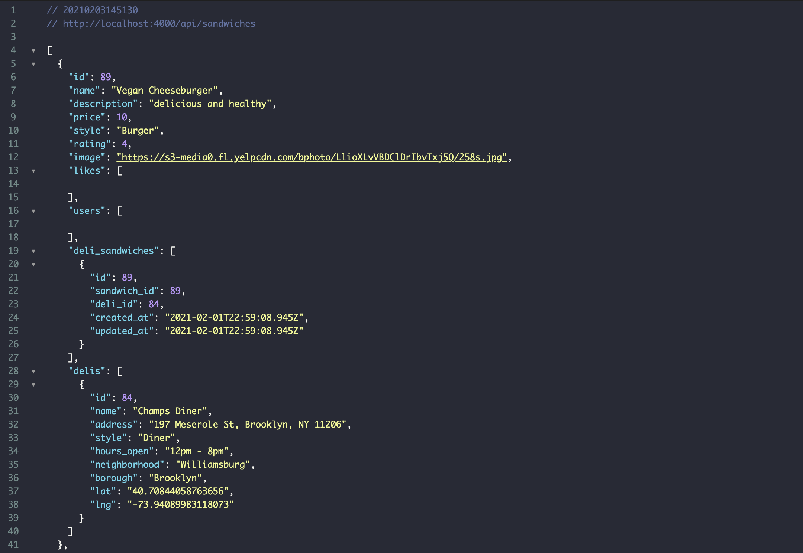

# Roll or Hero

## Overview

Welcome to Roll or Hero.  Here you can browse the trendy sandwiches of NYC by review, deli, or even sandwich.  If you see a deli or restaurant not show on the map you can search and add the deli and its corrisponding sandwiches!

## User stories

1. A user can see real time google map locations of sandwiches and delis in the roll or hero db.
2. A user can filter through delis by genre / sandwiches by style / location by borough.
3. A user can search for a location in New York city and add that location.
4. A user can write a review of a specific deli/restaurant.
5. A user can edit their review.
6. A user can login. 

## To Run
**Setup**
* git clone git@github.com:JlordA/rollorhero-frontend.git
* cd rollorhero-frontend
* bundle install or npm install

**To start the Client:**
* npm install or bundle install (from backend repo)
* rails s (from backend repo)

The client is running on http://localhost:3000/

**To start the Server:**
* npm install
* npm start

**Login:**
username: James
password: Password4321

Server uses a postgresql database.  The server is running on:

http://localhost:400/api/sandwiches

http://localhost:400/api/delis

http://localhost:400/api/reviews

**Example of /api/sandwiches**

# Token
Create a file called "token" and paste in your API key